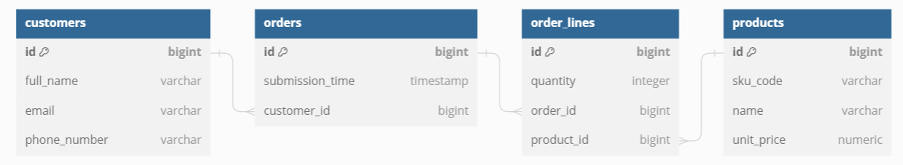
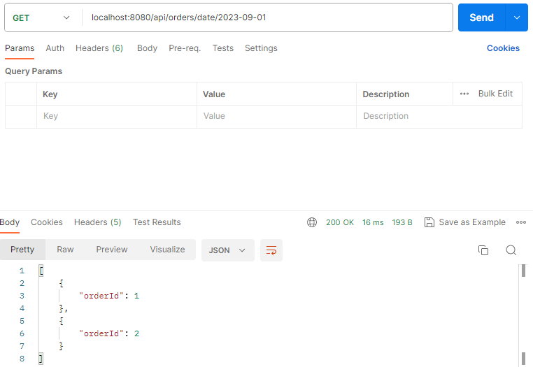

# Kuehne + Nagel Internship Assessment - Spring Boot Application

This is the repository for the Kuehne + Nagel Internship Assessment Spring Boot application. The application demonstrates the usage of Java, Spring Boot, Spring Data JPA, PostgreSQL, Lombok, Liquibase, Testcontainers, JPQL, and Criteria/Specification queries in the context of the assessment.

## Prerequisites
- Java 17
- Maven
- Docker (for running PostgreSQL through Testcontainers)
- PostgreSQL

## Tech Stack
- Java 17
- Maven
- Spring Boot
- Spring Data JPA
- PostgreSQL
- Lombok
- Liquibase
- Testcontainers
- JPQL
- Criteria/Specification Queries
- Swagger docs

## API functionality
- Customer: create, get all customers
- Product: create, get all products
- Order: create, get all orders, get orders by date, change product quantity in order line, get orders by customer 
using jpql and specification query (duplicated in educational purposes), get orders by product using jpql and 
specification query (duplicated in educational purposes)

## Running the Application
1. Clone this repository
2. Create a PostgreSQL DB and enter it's credentials in src/main/resources/application.properties 
3. Run the application
4. (In order to run tests - run the Docker engine on your PC)

## Model Description and Diagram
- Customer: id, fullName, email(unique), phoneNumber
- Order: id, submissionTime, customerId
- OrderLine: id, orderId, productId, quantity [orderId and productId pair is unique]
- Product: id, skuCode(unique), name, unitPrice

## Api documentation
- Api documentation is also available at http://localhost:8080/swagger-ui/index.html#/

## Exception handling
### Error response is returned if:
* Creating customer with blank fields, invalid email format or not unique email, invalid phone number format
* Creating product with blank fields, not unique sku code, not positive price
* Creating order with blank fields, not positive quantity, duplicate products, not existing product or customer
* Changing order line product quantity with negative quantity, not existing order line
* Getting orders by invalid date format

## Other system features
- If quantity in order line is changed to zero then order line is removed and if removed order line was the last
order line in order then order is removed also
- If customer is removed then his orders and corresponding order lines are removed (No api for customer removing is done)
- If order is removed then corresponding order lines are removed (No api for order removing is done)
- If product is removed then order lines containing that product are removed (No api for product removing is done)

## API usage examples

